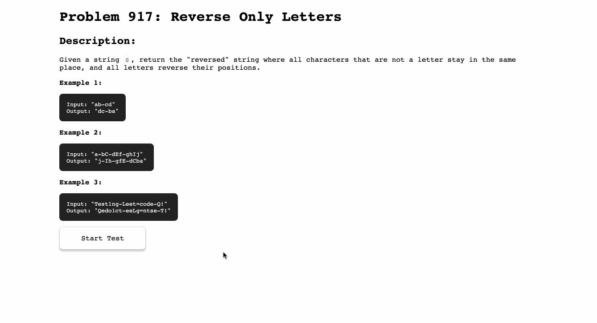

# Problem 917: Reverse Only Letters

Given a string `S`, return the "reversed" string where all characters that are not a letter stay in the same place, and all letters reverse their positions.

### Example

Example 1:
```
  Input: "ab-cd"
  Output: "dc-ba"
```

Example 2:
```
  Input: "a-bC-dEf-ghIj"
  Output: "j-Ih-gfE-dCba"
```

Example 3:
```
  Input: "Test1ng-Leet=code-Q!"
  Output: "Qedo1ct-eeLg=ntse-T!"
```

### Demo

