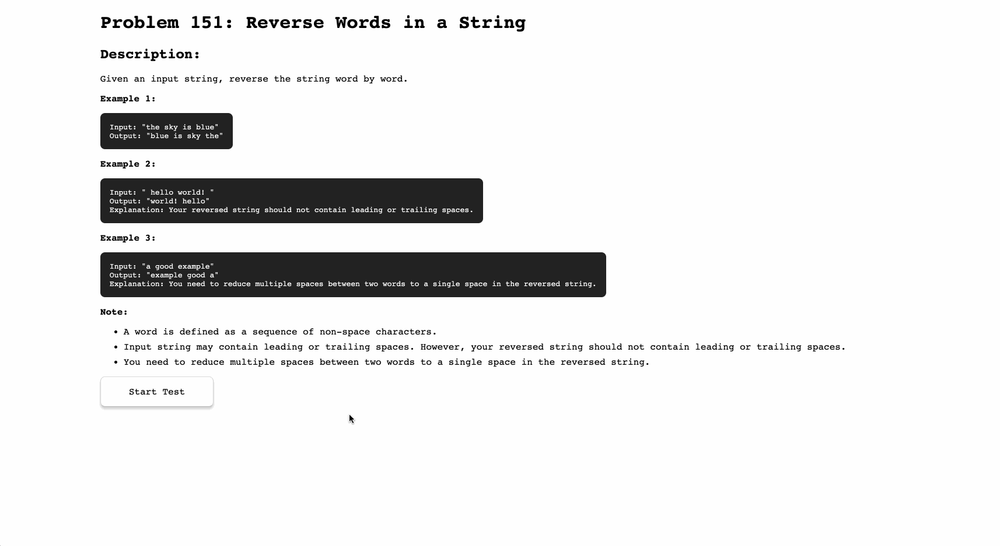

# Problem 151: Reverse Words in a String

Given an input string, reverse the string word by word.

## Example

Example 1:

```bash
Input: "the sky is blue"
Output: "blue is sky the"
```

Example 2:

```bash
Input: " hello world! "
Output: "world! hello"
Explanation: Your reversed string should not contain leading or trailing spaces.
```

Example 3:

```bash
Input: "a good example"
Output: "example good a"
Explanation: You need to reduce multiple spaces between two words to a single space in the reversed string.
```

Note:
- A word is defined as a sequence of non-space characters.
- Input string may contain leading or trailing spaces. However, your reversed string should not contain leading or trailing spaces.
- You need to reduce multiple spaces between two words to a single space in the reversed string.

## Demo


